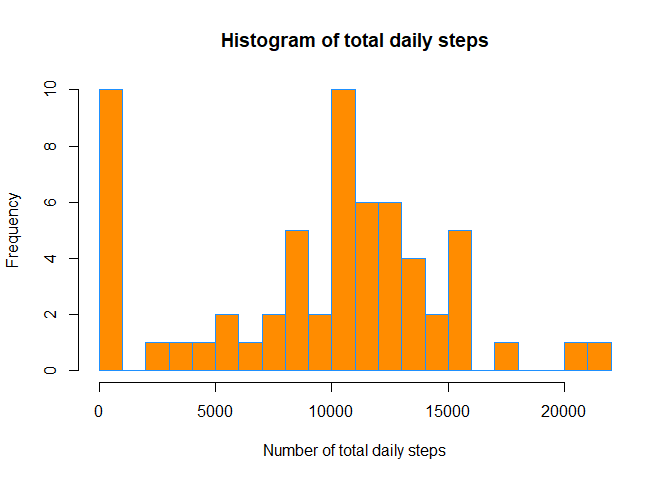
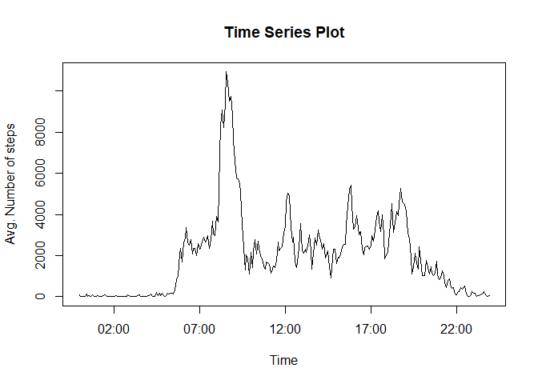
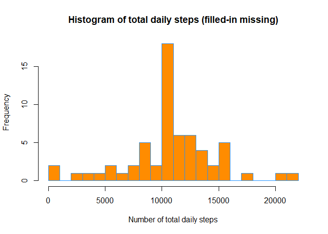
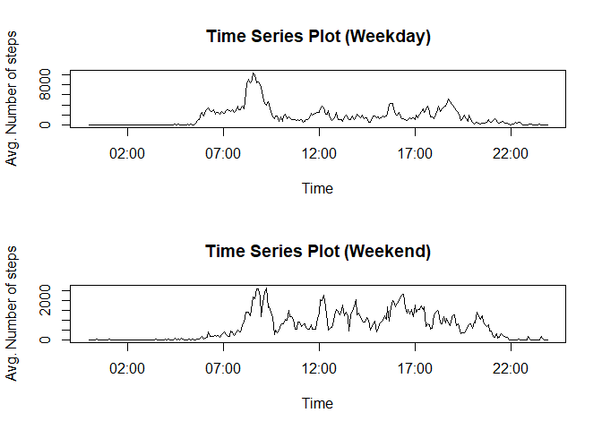

## Loading and preprocessing the data

We begin by reading in the activity data and formatting the 5-minute interval as a more readable time format.


```r
options(scipen=999)
activity = read.csv("activity.csv")
activity$interval = format(strptime(sprintf("%04d", activity$interval), format="%H%M"), format = "%H:%M")
```


## What is mean total number of steps taken per day?

Here, we sum the total number of steps per day and then display a histogram of total daily steps.


```r
agg_activity = aggregate(activity$steps, by=list(Category=activity$date), FUN=sum, na.rm=TRUE)
hist(agg_activity$x, col = "darkorange", border = "dodgerblue", main = "Histogram of total daily steps", xlab = "Number of total daily steps", 20)
```

<!-- -->

- Mean number of total daily steps = $9354.2295082$
- Median number of total daily steps = $10395$


## What is the average daily activity pattern?

Here, we sum the total number of steps per 5-minute interval and display a Time Series Plot of step activity throughout a 24-hour day.


```r
agg_activity = aggregate(activity$steps, by=list(Category=activity$interval), FUN=sum, na.rm=TRUE)
plot(as.POSIXct(agg_activity$Category,format="%H:%M"), agg_activity$x, type = "l", xlab="Time", ylab="Avg. Number of steps", main="Time Series Plot")
```

<!-- -->

Time period with the highest number of steps = $08:35$


## Imputing missing values

Here, we will find any missing values in the data set, and will replace these with the average number of steps for its 5-minute interval.


```r
count = 0
for (i in 1:length(activity$steps)) {
    if (is.na(activity$steps[i])) {
      count = count + 1
      activity$steps[i] = mean(activity$steps[activity$interval == activity$interval[i]], na.rm = TRUE)
    }
}
```
Number of missing values: $2304$

We can then examine the resulting histogram and compare it to the one created above.


```r
agg_activity = aggregate(activity$steps, by=list(Category=activity$date), FUN=sum, na.rm=TRUE)
hist(agg_activity$x, col = "darkorange", border = "dodgerblue", main = "Histogram of total daily steps (filled-in missing)", xlab = "Number of total daily steps", 20)
```

<!-- -->

- Mean number of total daily steps (filled-in missing) = $10766.1886792$
- Median number of total daily steps (filled-in missing) = $10766.1886792$


As you can see, artificially filling in the missing values with the average value for its 5-minute interval does affect the histogram, the mean, and the median.  There are many more days with total step count that fall in the middle of the histogram, and far fewer days with a zero total step count.  As a result of this, the mean and median are both increased significantly. 


## Are there differences in activity patterns between weekdays and weekends?

Here, we add two new fields to the dataframe to store day of the week and whether the day is a weekday or weekend.  Then we create a panel plot of Time Series Plots of step activity throughout a 24-hour day, comparing weekdays and weekends.


```r
activity$dayOfWeek = weekdays(as.Date(activity$date, format = "%Y-%m-%d"))
activity$dayType = ifelse(activity$dayOfWeek == 'Saturday' | activity$dayOfWeek == 'Sunday',
                          'weekend','weekday')

activity_weekday = split(activity, activity$dayType)[[1]]
activity_weekend = split(activity, activity$dayType)[[2]]

agg_activity_weekday = aggregate(activity_weekday$steps, by=list(Category=activity_weekday$interval), FUN=sum,
                                 na.rm=TRUE)
agg_activity_weekend = aggregate(activity_weekend$steps, by=list(Category=activity_weekend$interval), FUN=sum,
                                 na.rm=TRUE)

par(mfrow = c(2,1))
plot(as.POSIXct(agg_activity_weekday$Category,format="%H:%M"), agg_activity_weekday$x, type = "l", xlab="Time", ylab="Avg. Number of steps", main="Time Series Plot (Weekday)")
plot(as.POSIXct(agg_activity_weekend$Category,format="%H:%M"), agg_activity_weekend$x, type = "l", xlab="Time", ylab="Avg. Number of steps", main="Time Series Plot (Weekend)")
```

<!-- -->

There do appear to be differences in daily patterns between weekdays and weekends.  More steps are taken on weekdays, especially during the spike in morning hours.  On weekends, the number of overall steps are lower, and it is more evenly spread throughout the time period from 8:00 to 21:00.
